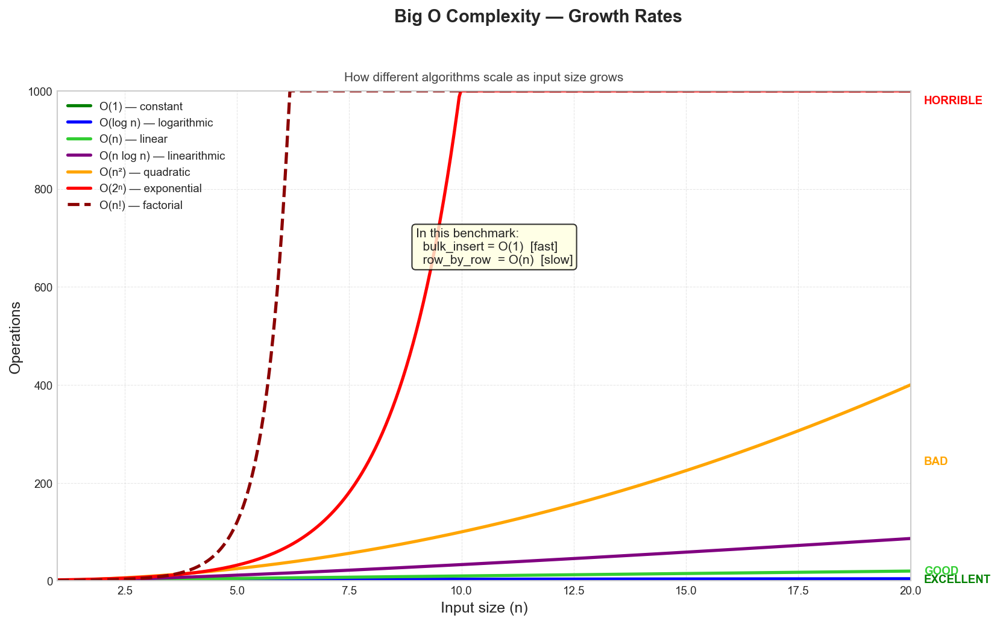
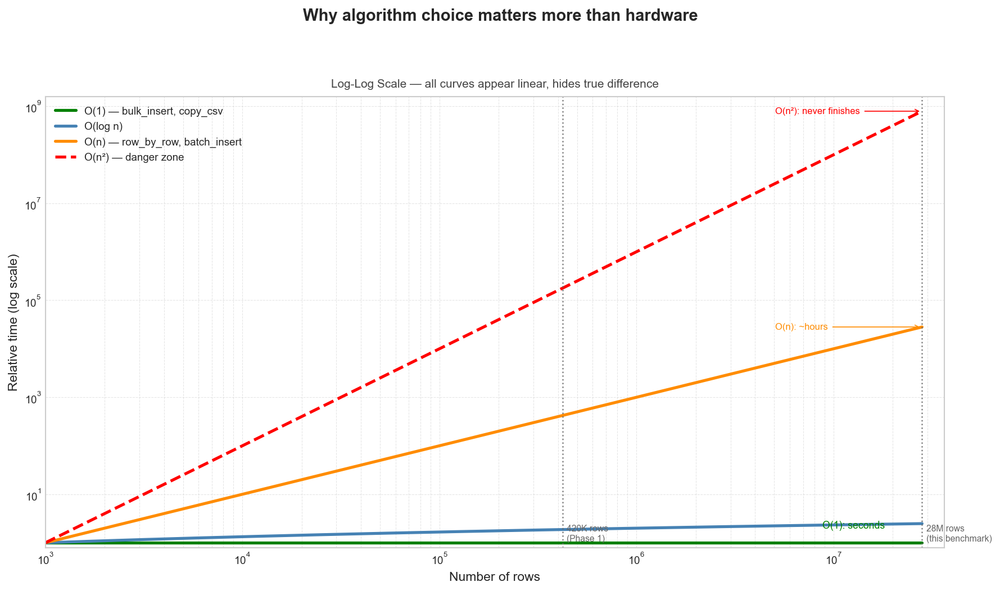
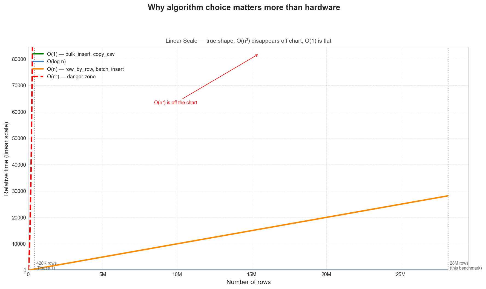

# Performance Benchmark — Python Data Storage

> Benchmarking DuckDB, Parquet, and PostgreSQL on 28,151,758 rows of real financial data across 8,049 stock and ETF tickers spanning 40+ years.

---

## Dataset

| Property | Value |
|---|---|
| Source | Kaggle — US Stock Market Dataset |
| Stocks | 5,884 tickers |
| ETFs | 2,165 tickers |
| Total symbols | 8,049 |
| Total rows | 28,151,758 |
| Date range | 1962–2024 |
| Columns | date, ticker, type, open, high, low, close, volume |
| Raw CSV size | ~2.46 GB |

---

## Test Environment

| Component | Spec |
|---|---|
| CPU | Intel Core i5-12400F (6 cores / 12 threads, 2.50 GHz base / 4.40 GHz boost) |
| GPU | NVIDIA RTX 4060 8GB (not used) |
| RAM | 31.8 GB |
| Storage | NVMe SSD |
| OS | Windows 11 |
| Python | 3.13.4 |
| Polars | 1.20.0 |
| DuckDB | 1.2.2 |
| Pandas | 2.2.3 |

---

## Methodology

- Each loader implements three operations: **write**, **read**, **query**
- Query: `GROUP BY ticker` — `AVG / MAX / MIN` of close price
- Metrics: `duration_sec`, `peak_ram_mb`, `cpu_percent`, `disk_size_mb`
- Measured via `benchmark/metrics.py` using `psutil` background thread + `time.perf_counter`
- **DNF variants** (row_by_row, batch_insert): estimated 6–10h at 28M rows — benchmarked on 100K subset and extrapolated linearly
- Results saved to `results/benchmark_results.json`

---

## Big O Complexity

### Complexity Growth Rates


### Log-Log Scale
> All curves appear linear — this is why log-log can be misleading


### Linear Scale
> True shape — O(n²) is off the chart, O(1) is flat, O(n) is diagonal


| Method | Technology | Write | Read | Query | Write note |
|---|---|---|---|---|---|
| row_by_row (pandas) | DuckDB | O(n) | O(n) | O(n) | 1 Python call per row |
| row_by_row (polars) | DuckDB | O(n) | O(n) | O(n) | 1 Python call per row |
| batch_insert (pandas) | DuckDB | O(n) | O(n) | O(n) | same loop, larger chunks |
| batch_insert (polars) | DuckDB | O(n) | O(n) | O(n) | same loop, larger chunks |
| bulk_insert (pandas) | DuckDB | O(1) | O(n) | O(k) | single vectorized call |
| bulk_insert (polars) | DuckDB | O(1) | O(n) | O(k) | single vectorized call |
| copy_csv | DuckDB | O(1) | O(n) | O(k) | no Python loop, C++ direct |
| direct_parquet | DuckDB | O(0) | O(n) | O(k) | no write step |
| single_file (pandas) | Parquet | O(1) | O(n) | O(k) | single vectorized write |
| single_file (polars) | Parquet | O(1) | O(n) | O(k) | single vectorized write |
| lazy (polars) | Parquet | O(1) | O(n) | O(k) | lazy, collect only needed |
| compressed (snappy/gzip) | Parquet | O(1) | O(n) | O(k) | single vectorized write |
| partitioned (per ticker) | Parquet | O(p) | O(1*) | O(1*) | p = num tickers, 1 file each |
| bulk_copy (COPY FROM) | Postgres | O(1) | O(n) | O(n) | server-side COPY, no Python loop |
| batch_insert (psycopg2) | Postgres | O(n) | O(n) | O(n) | executemany loop |
| row_by_row (psycopg2) | Postgres | O(n) | O(n) | O(n) | 1 Python call per row |

> *O(1) read/query only when filtered by ticker (partition pruning). Full scan = O(p).

---

## Results

### Write — 28,151,758 rows (full benchmark)

| Method | Duration | Peak RAM | Disk |
|---|---|---|---|
| 🏆 parquet partitioned | 0.23s* | 201 MB | 23 MB |
| duckdb bulk_insert (polars) | 3.48s | 4,871 MB | 5,408 MB |
| parquet lazy_polars | 6.21s | 7,702 MB | 320 MB |
| duckdb copy_csv | 6.25s | 5,241 MB | 6,336 MB |
| parquet single_file (polars) | 6.31s | 7,651 MB | 320 MB |
| parquet single_file (pandas) | 11.54s | 6,402 MB | 375 MB |
| duckdb bulk_insert (pandas) | 11.69s | 6,172 MB | 4,356 MB |
| parquet compressed snappy | 12.09s | 7,656 MB | 375 MB |
| parquet compressed gzip | 30.34s | 7,634 MB | 295 MB |
| postgres bulk_copy | 263.43s | 16,352 MB | — |
| mongodb bulk_insert (ordered=False) | 208.83s | 2,608 MB | — |
| mongodb bulk_insert (ordered=True) | 244.31s | 2,608 MB | — |

> \* extrapolated from 100K subset — partitioned write is O(p) where p = number of tickers

### Write — 100K Subset (extrapolated to 28M)

| Method | Technology | Write (100K) | Extrapolated 28M | RAM (100K) |
|---|---|---|---|---|
| row_by_row (pandas) | DuckDB | 76.67s | ~6.0h ❌ | 249 MB |
| row_by_row (polars) | DuckDB | 76.06s | ~5.9h ❌ | 195 MB |
| batch_insert (pandas) | DuckDB | 77.87s | ~6.1h ❌ | 192 MB |
| batch_insert (polars) | DuckDB | 76.66s | ~6.0h ❌ | 172 MB |
| row_by_row | Postgres | 36.43s | ~2.8h ❌ | 187 MB |
| batch_insert | Postgres | 36.89s | ~2.9h ❌ | 202 MB |
| bulk_insert | SQL Server | 72.85s | ~5.7h ❌ | 185 MB |
| bulk_columnstore | SQL Server | 68.20s | ~5.3h ❌ | 187 MB |
| row_by_row | SQL Server | 72.25s | ~5.7h ❌ | 245 MB |
| row_by_row | MongoDB | 76.40s | ~6.0h ❌ | 213 MB |

> All variants benchmarked on 100K rows and extrapolated linearly. RAM measured on subset only.

### Read — 28,151,758 rows

| Method | Duration | Peak RAM |
|---|---|---|
| 🏆 parquet lazy_polars | 0.39s | 8,075 MB |
| parquet single_file (polars) | 0.40s | 8,213 MB |
| parquet partitioned | 1.18s* | 355 MB |
| parquet single_file (pandas) | 3.11s | 7,584 MB |
| parquet compressed snappy | 3.42s | 7,221 MB |
| duckdb bulk_insert (pandas) | 5.29s | 7,195 MB |
| duckdb copy_csv | 5.59s | 10,407 MB |
| duckdb bulk_insert (polars) | 6.06s | 10,619 MB |
| duckdb direct_parquet | 7.91s | 11,170 MB |
| postgres bulk_copy | 159.16s | 19,125 MB |
| mongodb bulk_insert (ordered=False) | 7.80s* | 2,565 MB |
| mongodb bulk_insert (ordered=True) | 0.05s* | 2,565 MB |

> \* extrapolated from 100K subset

> \*MongoDB read = single ticker (AAPL, 9,909 docs) — full scan causes OOM on 32GB RAM

### Query — GROUP BY ticker, AVG/MAX/MIN close

| Method | Duration | Peak RAM |
|---|---|---|
| 🏆 duckdb direct_parquet | 0.13s | 3,612 MB |
| duckdb bulk_insert (pandas) | 0.14s | 620 MB |
| duckdb copy_csv | 0.17s | 3,898 MB |
| duckdb bulk_insert (polars) | 0.18s | 3,891 MB |
| parquet partitioned | 0.32s* | 328 MB |
| parquet lazy_polars | 0.98s | 7,793 MB |
| parquet single_file (polars) | 1.08s | 7,896 MB |
| parquet single_file (pandas) | 2.03s | 6,659 MB |
| parquet compressed snappy | 2.20s | 6,162 MB |
| postgres bulk_copy | 24.27s | 3,474 MB |
| mongodb bulk_insert (ordered=False) | 23.57s | 2,565 MB |
| mongodb bulk_insert (ordered=True) | 24.60s | 2,565 MB |

> \* extrapolated from 100K subset

---

## Key Insights

**Algorithm dominates hardware.**
The gap between O(n) and O(1) at 28M rows is not a performance difference — it is the difference between finishing in seconds and not finishing at all. row_by_row and batch_insert variants were estimated at 6–10 hours. bulk_insert completed in under 12 seconds. Same machine, same data, same destination.

**Batch insert ≈ row_by_row — and this is not obvious.**
Intuitively, sending 10,000 rows per trip should be 10,000x faster than one row per trip. It is not. When DuckDB runs in-process, each round trip costs almost nothing. The bottleneck is the Python loop itself — whether it runs 28 million times or 2,800 times, the overhead per iteration dominates. Only eliminating the loop entirely (bulk/vectorized) produces a real speedup.

**DuckDB query speed is independent of how data was inserted.**
Every DuckDB variant — regardless of write method — completed the GROUP BY query in under 0.2 seconds. The columnar engine operates the same way whether data arrived via row_by_row or bulk_insert. Write method affects write performance only.

**Parquet + Polars is the practical sweet spot.**
Write: 6.3s. Read: 0.4s. Disk: 320 MB. No database process required, no Docker, no connection overhead. For single-machine analytics workloads, this combination outperforms every database option tested on both speed and simplicity.

**Postgres COPY looks fast — until you read.**
postgres bulk_copy wrote 28M rows in 263 seconds, which is reasonable. But reading those same rows back took 159 seconds and consumed 19 GB of RAM — because Pandas fetches the entire result set into memory via DBAPI2. Postgres is not wrong here; the combination of Postgres + Pandas + SELECT * at this scale is the problem.

**Partitioned Parquet: the write/read tradeoff in practice.**
Writing 8,049 individual ticker files is O(p) — slow at scale, extrapolated to hours if naively implemented without parallelism. But reading a single ticker requires touching exactly one file: O(1). This is the correct architecture for ticker-filtered queries in production. The benchmark exposes why: partitioned read at 1.18s with only 355 MB RAM vs 8 GB for a full file scan.

**Memory cliff at production scale.**
Several methods that appeared reasonable at 48 tickers became dangerous at 8,049. postgres_bulk_copy_read peaked at 19,125 MB — nearly 60% of total system RAM — on a read operation alone. At 28M rows, memory usage is not an implementation detail. It is an architectural constraint.

**MongoDB full scan causes OOM — document stores need different benchmarking strategy.**
Calling find({}) on 28M documents caused Windows OOM dialog on 32GB RAM. Each MongoDB document stores field names alongside values — unlike columnar formats that share schema. At 28M documents × 8 fields × ~1KB Python object overhead = ~28GB before pandas DataFrame conversion. The fix was chunked reads, but full-scan benchmarking is not the intended use case for document stores. MongoDB shines at single-document lookups: find({ticker: "AAPL"}) with an index returned 9,909 documents in 0.05s.

**Data locality matters — ordered vs unordered insert changes read speed 156x.**
insert_many(ordered=False) allows MongoDB to write documents in parallel, scattering them across disk. insert_many(ordered=True) writes sequentially, keeping related documents physically adjacent. When reading AAPL documents, ordered=True returned results in 0.05s vs 7.80s for ordered=False — a 156x difference from disk locality alone, with identical indexes and identical queries.

---

## How to Run

```bash
# 1. Install dependencies
python -m venv .venv
.venv\Scripts\activate
pip install -r requirements.txt

# 2. Start Postgres
docker compose up -d

# 3. Download Kaggle dataset
# https://www.kaggle.com/datasets/jacksoncrow/stock-market-dataset
# Place CSV files in:
#   kaggle-dataset/stocks/   (5,884 files)
#   kaggle-dataset/etfs/     (2,165 files)

# 4. Build combined dataset (28M rows)
py -m loaders.kaggle_loader

# 5. Run all benchmarks
py -m benchmark.run_benchmark

# 6. View results table
py -m benchmark.run_all

# 7. View Big O complexity table
py -m benchmark.complexity

# 8. View system info
py -m benchmark.system_info
```

---

## Project Structure

```
performance-benchmark/
├── benchmark/
│   ├── complexity.py       # Big O complexity table for all variants
│   ├── metrics.py          # measure duration, RAM, CPU, disk
│   ├── run_all.py          # print results comparison table
│   ├── run_benchmark.py    # master runner — all loaders in sequence
│   └── system_info.py      # auto-detect hardware and software specs
├── loaders/
│   ├── duckdb/             # 7 variants: row_by_row, batch, bulk, copy_csv, direct_parquet
│   ├── parquet/            # 5 variants: single_file, lazy, compressed, partitioned
│   ├── postgres/           # 3 variants: row_by_row, batch, bulk_copy
│   └── kaggle_loader.py    # builds all_stocks.csv from 8,049 CSV files
├── results/
│   ├── benchmark_results.json
│   └── benchmark_summary.md
├── data/
│   ├── raw/                # all_stocks.csv (2.46 GB)
│   ├── duckdb/             # DuckDB database files
│   ├── parquet/            # Parquet files
│   └── postgres/           # (managed by Docker)
├── kaggle-dataset/
│   ├── stocks/             # 5,884 CSV files
│   └── etfs/               # 2,165 CSV files
└── docker-compose.yml
```

---

## License

MIT
