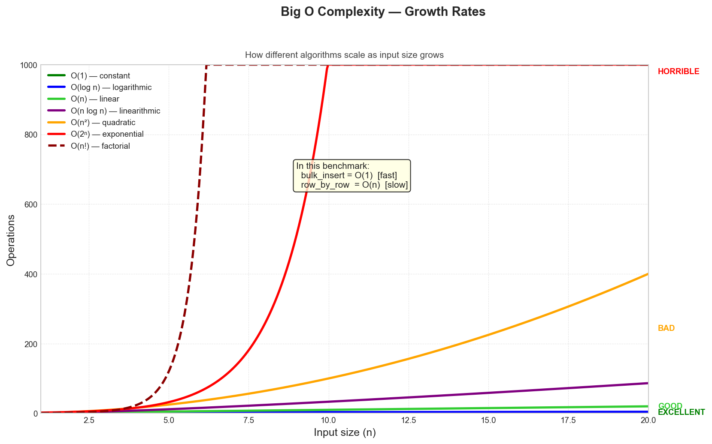
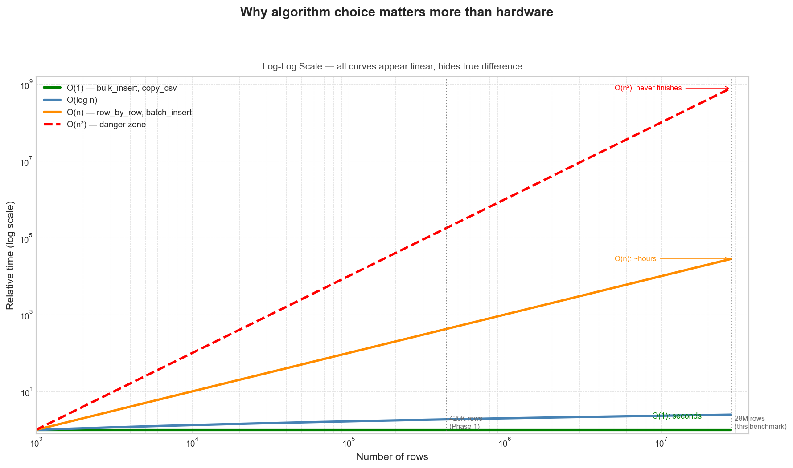
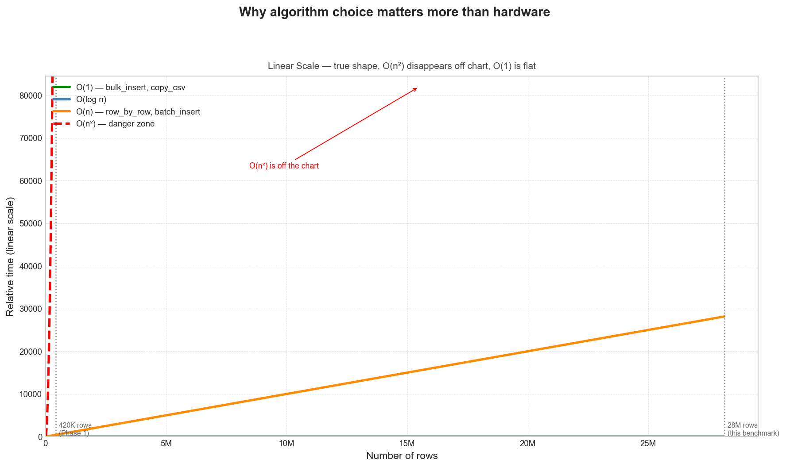

# Performance Benchmark — Python Data Storage

> Benchmarking DuckDB, Parquet, PostgreSQL, SQL Server, MongoDB, Redis, Redpanda, and Neo4j on 28,151,758 rows of real financial data across 8,049 stock and ETF tickers spanning 40+ years. Covers bulk load, star schema, OLTP indexed queries, JOIN performance, concurrent reads, sorted sets, cache simulation, real-time streaming, and graph traversal.

> **Phase 1–6 establish the baseline — no connection pooling, no query optimisation, no engine tuning. Every paradigm runs with default configuration out of the box.**
> - Phase 1–3: DuckDB, Parquet, Postgres, SQL Server, MongoDB — bulk load, star schema, OLTP
> - Phase 4: Redis — key-value, sorted set, cache simulation
> - Phase 5: Redpanda — streaming producer/consumer
> - Phase 6: Neo4j — graph traversal, OLTP, concurrent reads
>
> **Phase 7 applies 7 successive optimisations to PostgreSQL — DataFrame engine swap, pgBouncer + psycopg3 binary protocol, COPY binary/CSV, async pipeline, and ADBC Arrow Flight.**
> - Phase 7A–7C: Polars vs Pandas — 6–10× DataFrame speedup; bottleneck diagnosis
> - Phase 7D: pgBouncer + psycopg3 — Postgres read 159s → 109s; Redpanda 1,933 → 10,545 rows/sec
> - Phase 7E: COPY binary/CSV protocol — read 159s → 67s, RAM 19 GB → 4.3 GB
> - Phase 7F: async 4-chunk ctid SELECT — GIL ceiling confirmed, query 24s → 18s
> - Phase 7G: ADBC Arrow Flight — read 159s → 61s (2.60×), write 263s → 133s (1.98×)

---

## Dataset

| Property | Value |
|---|---|
| Source | Kaggle — US Stock Market Dataset |
| Stocks | 5,884 tickers |
| ETFs | 2,165 tickers |
| Total symbols | 8,049 |
| Total rows | 28,151,758 |
| Date range | 1962–2024 |
| Columns | date, ticker, type, open, high, low, close, volume |
| Raw CSV size | ~2.46 GB |

---

## Test Environment

| Component | Spec |
|---|---|
| CPU | Intel Core i5-12400F (6 cores / 12 threads, 2.50 GHz base / 4.40 GHz boost) |
| GPU | NVIDIA RTX 4060 8GB (not used) |
| RAM | 31.8 GB |
| Storage | NVMe SSD |
| OS | Windows 11 |
| Python | 3.13.4 |
| Polars | 1.20.0 |
| DuckDB | 1.2.2 |
| Pandas | 2.2.3 |
| Redis | 7.4.8 |
| MongoDB | 7.0.32 |
| Redpanda | v26.1.6 |
| Neo4j | 5.26.25 |
| kafka-python | 2.3.1 |
| neo4j (Python driver) | 6.1.0 |

---

## Methodology

- Each loader implements three operations: **write**, **read**, **query**
- Query: `GROUP BY ticker` — `AVG / MAX / MIN` of close price
- Metrics: `duration_sec`, `peak_ram_mb`, `cpu_percent`, `disk_size_mb`
- Measured via `benchmark/metrics.py` using `psutil` background thread + `time.perf_counter`
- **DNF variants** (row_by_row, batch_insert): estimated 6–10h at 28M rows — benchmarked on 100K subset and extrapolated linearly
- Results saved to `results/benchmark_results.json`

---

## Big O Complexity

### Complexity Growth Rates


### Log-Log Scale
> All curves appear linear — this is why log-log can be misleading


### Linear Scale
> True shape — O(n²) is off the chart, O(1) is flat, O(n) is diagonal


| Method | Technology | Write | Read | Query | Write note |
|---|---|---|---|---|---|
| row_by_row (pandas) | DuckDB | O(n) | O(n) | O(n) | 1 Python call per row |
| row_by_row (polars) | DuckDB | O(n) | O(n) | O(n) | 1 Python call per row |
| batch_insert (pandas) | DuckDB | O(n) | O(n) | O(n) | same loop, larger chunks |
| batch_insert (polars) | DuckDB | O(n) | O(n) | O(n) | same loop, larger chunks |
| bulk_insert (pandas) | DuckDB | O(1) | O(n) | O(k) | single vectorized call |
| bulk_insert (polars) | DuckDB | O(1) | O(n) | O(k) | single vectorized call |
| copy_csv | DuckDB | O(1) | O(n) | O(k) | no Python loop, C++ direct |
| direct_parquet | DuckDB | O(0) | O(n) | O(k) | no write step |
| single_file (pandas) | Parquet | O(1) | O(n) | O(k) | single vectorized write |
| single_file (polars) | Parquet | O(1) | O(n) | O(k) | single vectorized write |
| lazy (polars) | Parquet | O(1) | O(n) | O(k) | lazy, collect only needed |
| compressed (snappy/gzip) | Parquet | O(1) | O(n) | O(k) | single vectorized write |
| partitioned (per ticker) | Parquet | O(p) | O(1*) | O(1*) | p = num tickers, 1 file each |
| bulk_copy (COPY FROM) | Postgres | O(1) | O(n) | O(n) | server-side COPY, no Python loop |
| batch_insert (psycopg2) | Postgres | O(n) | O(n) | O(n) | executemany loop |
| row_by_row (psycopg2) | Postgres | O(n) | O(n) | O(n) | 1 Python call per row |

> *O(1) read/query only when filtered by ticker (partition pruning). Full scan = O(p).

---

## Results

### Write — 28,151,758 rows (full benchmark)

| Method | Duration | Peak RAM | Disk |
|---|---|---|---|
| 🏆 parquet partitioned | 0.23s* | 201 MB | 23 MB |
| duckdb bulk_insert (polars) | 3.48s | 4,871 MB | 5,408 MB |
| parquet lazy_polars | 6.21s | 7,702 MB | 320 MB |
| duckdb copy_csv | 6.25s | 5,241 MB | 6,336 MB |
| parquet single_file (polars) | 6.31s | 7,651 MB | 320 MB |
| parquet single_file (pandas) | 11.54s | 6,402 MB | 375 MB |
| duckdb bulk_insert (pandas) | 11.69s | 6,172 MB | 4,356 MB |
| parquet compressed snappy | 12.09s | 7,656 MB | 375 MB |
| parquet compressed gzip | 30.34s | 7,634 MB | 295 MB |
| postgres bulk_copy | 263.43s | 16,352 MB | — |
| mongodb bulk_insert (ordered=False) | 208.83s | 2,608 MB | — |
| mongodb bulk_insert (ordered=True) | 244.31s | 2,608 MB | — |

> \* extrapolated from 100K subset — partitioned write is O(p) where p = number of tickers

### Write — 100K Subset (extrapolated to 28M)

| Method | Technology | Write (100K) | Extrapolated 28M | RAM (100K) |
|---|---|---|---|---|
| row_by_row (pandas) | DuckDB | 76.67s | ~6.0h ❌ | 249 MB |
| row_by_row (polars) | DuckDB | 76.06s | ~5.9h ❌ | 195 MB |
| batch_insert (pandas) | DuckDB | 77.87s | ~6.1h ❌ | 192 MB |
| batch_insert (polars) | DuckDB | 76.66s | ~6.0h ❌ | 172 MB |
| row_by_row | Postgres | 36.43s | ~2.8h ❌ | 187 MB |
| batch_insert | Postgres | 36.89s | ~2.9h ❌ | 202 MB |
| bulk_insert | SQL Server | 72.85s | ~5.7h ❌ | 185 MB |
| bulk_columnstore | SQL Server | 68.20s | ~5.3h ❌ | 187 MB |
| row_by_row | SQL Server | 72.25s | ~5.7h ❌ | 245 MB |
| row_by_row | MongoDB | 76.40s | ~6.0h ❌ | 213 MB |

> All variants benchmarked on 100K rows and extrapolated linearly. RAM measured on subset only.

### Read — 28,151,758 rows

| Method | Duration | Peak RAM |
|---|---|---|
| 🏆 parquet lazy_polars | 0.39s | 8,075 MB |
| parquet single_file (polars) | 0.40s | 8,213 MB |
| parquet partitioned | 1.18s* | 355 MB |
| parquet single_file (pandas) | 3.11s | 7,584 MB |
| parquet compressed snappy | 3.42s | 7,221 MB |
| duckdb bulk_insert (pandas) | 5.29s | 7,195 MB |
| duckdb copy_csv | 5.59s | 10,407 MB |
| duckdb bulk_insert (polars) | 6.06s | 10,619 MB |
| duckdb direct_parquet | 7.91s | 11,170 MB |
| postgres bulk_copy | 159.16s | 19,125 MB |
| mongodb bulk_insert (ordered=False) | 7.80s* | 2,565 MB |
| mongodb bulk_insert (ordered=True) | 0.05s* | 2,565 MB |

> \* extrapolated from 100K subset

> \*MongoDB read = single ticker (AAPL, 9,909 docs) — full scan causes OOM on 32GB RAM

### Query — GROUP BY ticker, AVG/MAX/MIN close

| Method | Duration | Peak RAM |
|---|---|---|
| 🏆 duckdb direct_parquet | 0.13s | 3,612 MB |
| duckdb bulk_insert (pandas) | 0.14s | 620 MB |
| duckdb copy_csv | 0.17s | 3,898 MB |
| duckdb bulk_insert (polars) | 0.18s | 3,891 MB |
| parquet partitioned | 0.32s* | 328 MB |
| parquet lazy_polars | 0.98s | 7,793 MB |
| parquet single_file (polars) | 1.08s | 7,896 MB |
| parquet single_file (pandas) | 2.03s | 6,659 MB |
| parquet compressed snappy | 2.20s | 6,162 MB |
| postgres bulk_copy | 24.27s | 3,474 MB |
| mongodb bulk_insert (ordered=False) | 23.57s | 2,565 MB |
| mongodb bulk_insert (ordered=True) | 24.60s | 2,565 MB |

> \* extrapolated from 100K subset

### Redis Key Numbers

| Metric | Value |
|---|---|
| Sorted set ZADD+ZRANGE top 10 | 0.01s |
| Cache hit latency | 0.308ms |
| Cache miss latency | 0.336ms (simulated) |
| KEYS scan (28M keys, 10 tickers) | 62s → ~835 min extrapolated ❌ |
| RAM footprint | 1,835MB permanent (all data in memory) |

### Redpanda Key Numbers

| Metric | Value |
|---|---|
| Producer max throughput | 21,787 rows/sec / 4.1 MB/sec |
| Consumer throughput (→ DuckDB) | 1,933 rows/sec |
| Consumer/Producer ratio | 8.9% |
| End-to-end latency (throttled) | 168.6ms |
| Throttled producer actual rate | 644 rows/sec (target 1,000) |
| Concurrent reads (single partition) | Linear scale — 5 threads = 5× slower |

### Neo4j Key Numbers

| Metric | Value |
|---|---|
| Graph traversal (1-hop, 910 tickers) | 0.07s |
| OLTP query (ticker_id=1, date range) | 0.07s |
| JOIN query (GROUP BY sector) | 0.14s |
| Concurrent 20 threads | 0.23s (best of all paradigms) |
| write_prices 28M nodes | DNF — RAM spike to 31GB ❌ |
| RAM footprint at idle | 153MB (lowest of all server paradigms) |

---

## Phase 7 — PostgreSQL Optimisation Results

Seven successive optimisations applied to the Phase 1 PostgreSQL baseline (psycopg2 + Pandas). Each phase targeted a different bottleneck — the DataFrame engine, the driver, the COPY path, connection pooling, async concurrency, and the client-side Arrow representation.

**Overall improvement (Phase 1 → Phase 7G):**

| Metric | Baseline (Phase 1) | Best Result | Improvement |
|---|---|---|---|
| Postgres Read (28M rows) | 159.16s / 19,125 MB | 61.20s / 6,723 MB (ADBC streaming) | **2.60×** |
| Postgres Write (28M rows) | 263.43s / 16,352 MB | 133.26s / 3,193 MB (ADBC ingest) | **1.98×** |
| Postgres Query (GROUP BY) | 24.27s | 18.31s (async psycopg3) | **1.32×** |

### Phase 7A–7C — DataFrame Engine (Polars vs Pandas)

| Operation | Pandas | Polars | Speedup |
|---|---|---|---|
| filter + groupby | 14.64s | 1.46s | 10.0× |
| pivot | 38.05s | 5.15s | 7.4× |
| multi-join | 19.11s | 1.98s | 9.7× |
| Redpanda consumer (best op) | 15.36s | 1.56s | 9.8× |

- Pure in-process DataFrame: Polars 6–10× faster across all 8 tested operations
- Redpanda consumer throughput with Polars backend: 12.5× faster
- Conclusion: drop-in replacement works at the DataFrame layer; Postgres and Redpanda throughput is protocol-bound, not DataFrame-bound

### Phase 7D — pgBouncer + psycopg3 Binary Protocol

| Change | Before | After | Improvement |
|---|---|---|---|
| Postgres read (psycopg3 binary) | 159.16s | 142s | -11% |
| Postgres read (+ pgBouncer pool=20) | 159.16s | 109s | **-31%** |
| Redpanda consumer (4 partitions) | 1,933 rows/sec | 10,545 rows/sec | **5.46×** |

### Phase 7E — COPY Protocol

| Strategy | Duration | Peak RAM | vs Phase 1 |
|---|---|---|---|
| psycopg2 baseline | 159.16s | 19,125 MB | — |
| COPY TO STDOUT FORMAT BINARY | 81.68s | 13,732 MB | -49% |
| 🏆 COPY TO STDOUT FORMAT CSV → Polars SIMD | 67.23s | 4,257 MB | **-58%, RAM -78%** |

### Phase 7F — Async Pipeline

| Operation | Before | After | Improvement |
|---|---|---|---|
| Read (async 4-chunk ctid) | 67.23s | 63.75s | 1.05× — GIL ceiling |
| Query (async GROUP BY) | 24.27s | 18.31s | **1.32×** |

GIL prevents true parallelism on the read path — 4 async chunks give marginal gains.
Server-side GROUP BY moves the bottleneck to Postgres executor, which async handles well.

### Phase 7G — ADBC Arrow Flight

| Operation | Duration | Peak RAM | vs Phase 1 |
|---|---|---|---|
| Write — adbc_ingest (COPY BINARY) | 133.26s | 3,193 MB | **-49%, 2.0×** |
| Read — fetch_arrow_table() | 101.56s | 6,506 MB | -36% (text protocol) |
| 🏆 Read — fetch_record_batch() streaming | 61.20s | 6,723 MB | **-62%, 2.60×** |
| Query — SELECT GROUP BY → Arrow | 18.56s | 3,169 MB | -23% |

`adbc_ingest()` uses true binary COPY — the only write path that halved both time and RAM.
ADBC read defaults to text protocol (date/ticker return as `string` not `date32`); streaming wins by avoiding full `pa.Table` materialisation before the cursor closes.

---

## Benchmark Summaries

| File | Focus |
|---|---|
| [results/base/bulk_load_benchmark.md](results/base/bulk_load_benchmark.md) | Bulk load — Write / Read / Analytical query across 5 paradigms |
| [results/base/star_schema_benchmark.md](results/base/star_schema_benchmark.md) | Star Schema — JOIN / OLTP indexed / no-index / Concurrent reads |
| [results/base/redis_benchmark.md](results/base/redis_benchmark.md) | Redis — Key-Value / Sorted Set / Cache simulation / Concurrent reads |
| [results/base/redpanda_benchmark.md](results/base/redpanda_benchmark.md) | Redpanda — Streaming anti-pattern vs true use case, producer/consumer throughput |
| [results/base/neo4j_benchmark.md](results/base/neo4j_benchmark.md) | Neo4j — Graph traversal, JOIN, OLTP, concurrent reads |
| [results/optimized/phase7a_dataframe_benchmark.md](results/optimized/phase7a_dataframe_benchmark.md) | Phase 7A — Polars vs Pandas: 8 operations, full results |
| [results/optimized/phase7b_polars_backend_benchmark.md](results/optimized/phase7b_polars_backend_benchmark.md) | Phase 7B — Polars as storage backend (Postgres, DuckDB, Parquet, Redpanda) |
| [results/optimized/phase7c_polars_vs_pandas_benchmark.md](results/optimized/phase7c_polars_vs_pandas_benchmark.md) | Phase 7C — Side-by-side comparison and decision matrix |
| [results/optimized/phase7d_pgbouncer_psycopg3_redpanda_multipartition_benchmark.md](results/optimized/phase7d_pgbouncer_psycopg3_redpanda_multipartition_benchmark.md) | Phase 7D — pgBouncer + psycopg3 binary; Redpanda multi-partition |
| [results/optimized/phase7e_copy_binary_benchmark.md](results/optimized/phase7e_copy_binary_benchmark.md) | Phase 7E — COPY BINARY and COPY CSV → Polars SIMD |
| [results/optimized/phase7f_async_pipeline_benchmark.md](results/optimized/phase7f_async_pipeline_benchmark.md) | Phase 7F — Async pipeline, ctid chunking, GIL ceiling analysis |
| [results/optimized/phase7g_arrow_flight_benchmark.md](results/optimized/phase7g_arrow_flight_benchmark.md) | Phase 7G — ADBC Arrow Flight: adbc_ingest write, streaming read |
| [results/optimized/phase7_final_summary.md](results/optimized/phase7_final_summary.md) | Phase 7 Final Summary — full progression across all 7 strategies |

---

## Key Insights

**Algorithm dominates hardware.**
The gap between O(n) and O(1) at 28M rows is not a performance difference — it is the difference between finishing in seconds and not finishing at all. row_by_row and batch_insert variants were estimated at 6–10 hours. bulk_insert completed in under 12 seconds. Same machine, same data, same destination.

**Batch insert ≈ row_by_row — and this is not obvious.**
Intuitively, sending 10,000 rows per trip should be 10,000x faster than one row per trip. It is not. When DuckDB runs in-process, each round trip costs almost nothing. The bottleneck is the Python loop itself — whether it runs 28 million times or 2,800 times, the overhead per iteration dominates. Only eliminating the loop entirely (bulk/vectorized) produces a real speedup.

**DuckDB query speed is independent of how data was inserted.**
Every DuckDB variant — regardless of write method — completed the GROUP BY query in under 0.2 seconds. The columnar engine operates the same way whether data arrived via row_by_row or bulk_insert. Write method affects write performance only.

**Parquet + Polars is the practical sweet spot.**
Write: 6.3s. Read: 0.4s. Disk: 320 MB. No database process required, no Docker, no connection overhead. For single-machine analytics workloads, this combination outperforms every database option tested on both speed and simplicity.

**Postgres COPY looks fast — until you read.**
postgres bulk_copy wrote 28M rows in 263 seconds, which is reasonable. But reading those same rows back took 159 seconds and consumed 19 GB of RAM — because Pandas fetches the entire result set into memory via DBAPI2. Postgres is not wrong here; the combination of Postgres + Pandas + SELECT * at this scale is the problem.

**Partitioned Parquet: the write/read tradeoff in practice.**
Writing 8,049 individual ticker files is O(p) — slow at scale, extrapolated to hours if naively implemented without parallelism. But reading a single ticker requires touching exactly one file: O(1). This is the correct architecture for ticker-filtered queries in production. The benchmark exposes why: partitioned read at 1.18s with only 355 MB RAM vs 8 GB for a full file scan.

**Memory cliff at production scale.**
Several methods that appeared reasonable at 48 tickers became dangerous at 8,049. postgres_bulk_copy_read peaked at 19,125 MB — nearly 60% of total system RAM — on a read operation alone. At 28M rows, memory usage is not an implementation detail. It is an architectural constraint.

**MongoDB full scan causes OOM — document stores need different benchmarking strategy.**
Calling find({}) on 28M documents caused Windows OOM dialog on 32GB RAM. Each MongoDB document stores field names alongside values — unlike columnar formats that share schema. At 28M documents × 8 fields × ~1KB Python object overhead = ~28GB before pandas DataFrame conversion. The fix was chunked reads, but full-scan benchmarking is not the intended use case for document stores. MongoDB shines at single-document lookups: find({ticker: "AAPL"}) with an index returned 9,909 documents in 0.05s.

**Data locality matters — ordered vs unordered insert changes read speed 156x.**
insert_many(ordered=False) allows MongoDB to write documents in parallel, scattering them across disk. insert_many(ordered=True) writes sequentially, keeping related documents physically adjacent. When reading AAPL documents, ordered=True returned results in 0.05s vs 7.80s for ordered=False — a 156x difference from disk locality alone, with identical indexes and identical queries.

---

## Examples — Anti-Patterns & Failure Cases

Real failures discovered during benchmarking, preserved as educational examples.

> These patterns worked fine at 48 tickers (Phase 1). They failed catastrophically at 28M rows (Phase 2). Scale reveals what correctness hides.

See [`examples/`](examples/README.md) for full details.

| Example | Pattern | Result |
|---|---|---|
| `examples/oom/mongodb_to_dicts_oom.py` | `to_dicts()` on 28M docs | OOM — 31GB RAM, Windows dialog |
| `examples/oom/mongodb_full_scan_oom.py` | `find({})` full collection scan | MemoryError mid-cursor |
| `examples/performance/parquet_partitioned_naive.py` | O(n×p) per-ticker loop | ~2h DNF at 8,049 tickers |
| `examples/performance/duckdb_row_by_row_vs_batch.py` | Python loop overhead | batch ≈ row_by_row (~6h both) |
| `examples/performance/redpanda_batch_as_database.py` | Using Kafka as queryable DB | 207s for 63 rows — 10,350× slower than DuckDB index |

---

## How to Run

```bash
# 1. Install dependencies
python -m venv .venv
.venv\Scripts\activate
pip install -r requirements.txt

# 2. Start all services
docker compose up -d
```

### Getting the Data

**Option 1 — Kaggle (original source)**
Download from: https://www.kaggle.com/datasets/jacksoncrow/stock-market-dataset
Place CSV files in:
	kaggle-dataset/stocks/  (5,884 files)
	kaggle-dataset/etfs/    (2,165 files)
Then run: `py -m loaders.kaggle_loader`

**Option 2 — Google Drive mirror (zip)**
https://drive.google.com/drive/folders/1bYgvAFPx6osSJbbpEhWhNfYQaG-sPgtx?usp=sharing
Download the zip, extract to kaggle-dataset/
Then run: `py -m loaders.kaggle_loader`

**Option 3 — Sample data (10K rows, no download needed)**
`data/sample/all_stocks_sample.csv` is included in this repo.
Usable immediately for testing without the full dataset.

```bash
# 4. Build combined dataset (28M rows)
py -m loaders.kaggle_loader

# 5. Run all benchmarks
py -m benchmark.run_benchmark

# Phase 3 — Star Schema benchmarks
# Generate star schema data (run once)
py -m data_prep.generate_star_schema

# Run star schema benchmarks per paradigm
py -m loaders.duckdb.star_schema
py -m loaders.parquet.star_schema
py -m loaders.postgres.star_schema
py -m loaders.sqlserver.star_schema
py -m loaders.mongodb.star_schema_embedded
py -m loaders.mongodb.star_schema_lookup

# Phase 4 — Redis benchmarks
# Start Redis (requires Docker)
docker compose up -d redis

py -m loaders.redis.star_schema

# Phase 5 — Redpanda benchmarks
# Start Redpanda (requires Docker)
docker compose up -d redpanda

py -m loaders.redpanda.star_schema   # anti-pattern benchmark
py -m loaders.redpanda.streaming     # true use case benchmark

# Phase 6 — Neo4j benchmarks
# Start Neo4j (requires Docker)
docker compose up -d neo4j

py -m loaders.neo4j.star_schema

# Phase 7 — PostgreSQL optimisations
# Install additional drivers
pip install "psycopg[binary]" adbc-driver-postgresql

# Start pgBouncer (transaction-mode pool, port 6432)
docker compose up -d pgbouncer

py -m loaders.postgres.pgbouncer_psycopg3  # Phase 7D — binary protocol + pgBouncer
py -m loaders.postgres.copy_binary          # Phase 7E — COPY BINARY and COPY CSV
py -m loaders.postgres.async_pipeline       # Phase 7F — async ctid chunking
py -m loaders.postgres.arrow_flight         # Phase 7G — ADBC adbc_ingest + streaming read
py -m loaders.redpanda.multi_partition      # Phase 7D — 4-partition parallel consumer

# 6. View results table
py -m benchmark.run_all

# 7. View Big O complexity table
py -m benchmark.complexity

# 8. View system info
py -m benchmark.system_info
```

### Interactive Dashboard

A full benchmark dashboard (all phases, interactive charts) is published at:
**https://[username].github.io/performance-benchmark/**

To run locally: open `docs/index.html` directly in a browser — no build step required.

---

## Project Structure

```
performance-benchmark/
├── benchmark/
│   ├── complexity.py       # Big O complexity table for all variants
│   ├── metrics.py          # measure duration, RAM, CPU, disk
│   ├── run_all.py          # print results comparison table
│   ├── run_benchmark.py    # master runner — all loaders in sequence
│   └── system_info.py      # auto-detect hardware and software specs
├── loaders/
│   ├── duckdb/             # 7 variants: row_by_row, batch, bulk, copy_csv, direct_parquet
│   ├── parquet/            # 5 variants: single_file, lazy, compressed, partitioned
│   ├── postgres/           # Phase 1–3: row_by_row, batch, bulk_copy
│   │   ├── pgbouncer_psycopg3.py  # Phase 7D — psycopg3 binary + pgBouncer pool
│   │   ├── copy_binary.py         # Phase 7E — COPY BINARY and COPY CSV → Polars
│   │   ├── async_pipeline.py      # Phase 7F — async ctid chunking
│   │   └── arrow_flight.py        # Phase 7G — ADBC adbc_ingest + streaming read
│   ├── sqlserver/          # 3 variants: bulk_insert, bulk_columnstore, row_by_row
│   ├── mongodb/            # 4 variants: bulk_insert, row_by_row, star_schema_embedded, star_schema_lookup
│   ├── redis/              # star_schema: write, OLTP, sorted set, cache simulation, concurrent
│   ├── redpanda/           # star_schema: batch anti-pattern; streaming: true use case
│   │   └── multi_partition.py     # Phase 7D — 4-partition parallel consumer
│   ├── neo4j/              # star_schema: write_graph, write_prices, JOIN, OLTP, traversal, concurrent
│   └── kaggle_loader.py    # builds all_stocks.csv from 8,049 CSV files
├── data_prep/
│   ├── generate_star_schema.py   # builds dim_symbols.csv + fact_prices.csv
│   └── generate_sample.py        # builds fact_prices_sample.csv (100K rows)
├── results/
│   ├── benchmark_results.json
│   ├── README.md
│   ├── base/
│   │   ├── bulk_load_benchmark.md
│   │   ├── star_schema_benchmark.md
│   │   ├── redis_benchmark.md
│   │   ├── redpanda_benchmark.md
│   │   └── neo4j_benchmark.md
│   └── optimized/
│       ├── phase7a_dataframe_benchmark.md
│       ├── phase7b_polars_backend_benchmark.md
│       ├── phase7c_polars_vs_pandas_benchmark.md
│       ├── phase7d_pgbouncer_psycopg3_redpanda_multipartition_benchmark.md
│       ├── phase7e_copy_binary_benchmark.md
│       ├── phase7f_async_pipeline_benchmark.md
│       ├── phase7g_arrow_flight_benchmark.md
│       └── phase7_final_summary.md
├── docs/
│   └── index.html          # GitHub Pages dashboard — all phases, interactive charts
├── data/
│   ├── raw/                # all_stocks.csv (2.46 GB)
│   ├── duckdb/             # DuckDB database files
│   ├── parquet/            # Parquet files
│   ├── star_schema/        # dim_symbols.csv, fact_prices.csv, fact_prices_sample.csv
│   └── postgres/           # (managed by Docker)
├── kaggle-dataset/
│   ├── stocks/             # 5,884 CSV files
│   └── etfs/               # 2,165 CSV files
└── docker-compose.yml
```

---

## License

MIT
